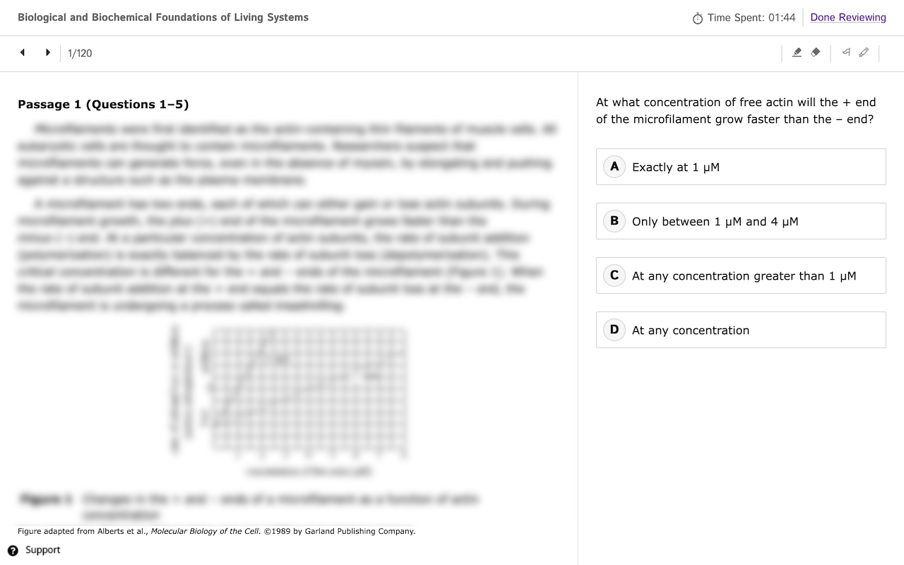
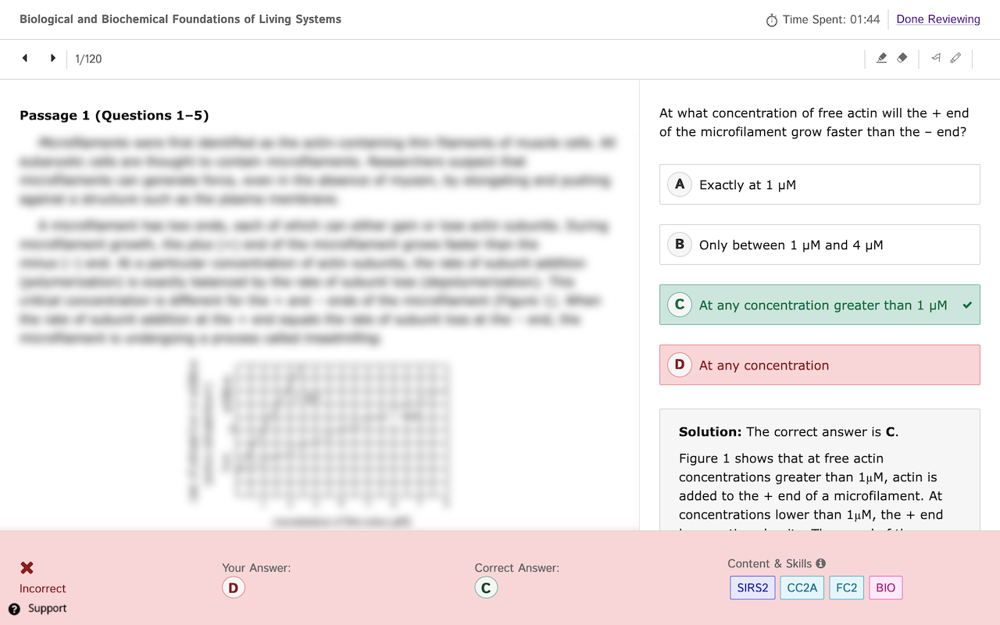

# MCAT® Official Prep (MOP) Review Tool
### An *unofficial* review tool for MCAT® Official Prep*

### Installation
This tool has been released on the following web stores for easy installation. Please click on the link for your browser below:
- [Mozilla Firefox](https://addons.mozilla.org/en-US/firefox/addon/mop-review-tool)
- [Google Chrome](https://chrome.google.com/webstore/detail/mop-review-tool/gibehjdihcgpmholbfbmpidgefnfpkod)

Alternatively, if your browser is not listed, you can clone this repository and install the extension manually. Also, please feel free to contact [raj@kundu.io](mailto:raj@kundu.io?subject=MOP%20Review%20Tool%20%2D%20Browser%20Support) or file an issue on GitHub!

### Usage

This tool hides/shows answers for easy self-retesting. To use it:
1) Filter questions that you would like to review using the MOP website. Open/enter the review screen which displays the content you wish to review.
2) In quiz mode, answers are hidden at first for every question. To view the answer, you can click on any of the answer choices or press the period (".") key.
3) Advance to the next question, either by clicking the navigation button or using the left/right arrow keys. In quiz mode, the answer choices for the new question will be hidden.

#### Keyboard Shortcuts

- Press `.` to show/hide answers for the current question
- Press `q` to enter quiz mode (hides answers for every question)
- Press `r` to enter review mode (shows answers for every question, like normal)
- Press `h` to view the help screen, which lists these shortcuts

By default, every time you enter a question review session, quiz mode is enabled. To disable quiz mode (i.e., enter review mode), use the `r` keyboard shortcut as detailed above.

### Screenshots

### Feedback

**Please submit any comments, suggestions, or other feedback to [raj@kundu.io](mailto:raj@kundu.io?subject=MOP%20Review%20Tool)!**

#### Attributions
The extension icons ([/icons](/icons)) are from [FontAwesome](https://fontawesome.com).

#### Note*
MCAT® is a registered trademark of the Association of American Medical Colleges (AAMC). This extension is NOT associated with either the MCAT® or the AAMC in any official capacity.
